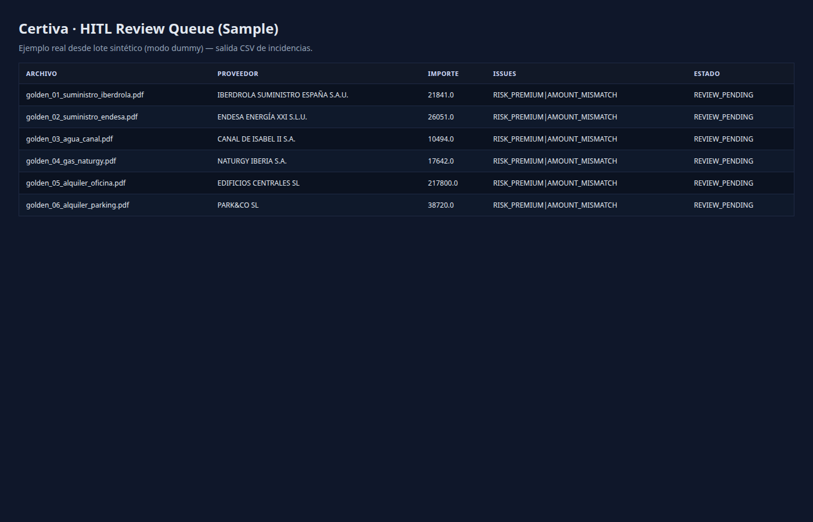

# Certiva — Technical Demonstration


**A technical demonstration of production-grade patterns for document processing pipelines.**

This is not a finished SaaS product. It is a **sandbox** demonstrating how to architect:
- Resilient OCR pipelines with circuit breakers
- Human-in-the-loop review queues  
- Multi-tenant data isolation
- Audit trails and observability

> **For recruiters/reviewers:** See [What to Evaluate](#what-to-evaluate) section below.

---

## 🎯 The Core Demonstration

**Input:** 34 PDF invoices (synthetic but realistic)  
**Process:** OCR → Normalization → Rules → HITL Review → Export  
**Output:** Structured CSV + SQLite audit trail

```
┌─────────┐    ┌─────────┐    ┌─────────┐    ┌─────────┐    ┌─────────┐
│  PDF    │ →  │   OCR   │ →  │  Rules  │ →  │  HITL   │ →  │   CSV   │
│  Input  │    │(Azure/  │    │ Engine  │    │ Review  │    │  Export │
│         │    │ Dummy)  │    │         │    │  Queue  │    │         │
└─────────┘    └─────────┘    └─────────┘    └─────────┘    └─────────┘
   SHA-256         ↓              ↓              ↓
 Deduplication  Circuit     Confidence    Web UI
               Breaker      Thresholds   (FastAPI)
```

---

## ⚡ Quick Start (Verify it Runs)

```bash
# Setup (one-time)
python3 -m venv .venv
source .venv/bin/activate
pip install -r requirements.txt

# Run the demonstration
python -m src.demo --reset
```

**Expected output:**
```
Processing 34 invoices from tests/golden/
✓ 24 auto-processed (70%)
⚠ 7 flagged for HITL review
✗ 3 errors (logged to incidencias.csv)

Output: OUT/demo/lote_TIMESTAMP/
├── a3_asientos.csv      # Accounting entries
├── incidencias.csv      # Items needing review
├── RESUMEN.txt          # Metrics report
└── logs/                # Full audit trail
```

---

## 📸 What It Actually Looks Like

### The Web UI (FastAPI + Jinja2)
When you run the full app (`uvicorn src.webapp:app`), you get:


*Dashboard showing: processed docs, confidence distribution, HITL queue size*

**Key UI Components:**
- **Dashboard** (`/`): Metrics, auto-post rate, processing times
- **Review Queue** (`/review`): Human validation interface for low-confidence docs
- **Audit Log**: Every action logged with before/after states

> **Note:** The GIF shows terminal output because the pipeline is primarily CLI-based. The web UI is for the HITL review phase.

---

## 🔍 What to Evaluate

**If you're a technical reviewer, focus on:**

| Aspect | Where to Look | What Demonstrates |
|--------|---------------|-------------------|
| **Architecture** | `src/` structure | Clean separation: OCR → Rules → Export |
| **Resilience** | `src/providers/azure_*.py` | Circuit breakers, retry logic, backoff |
| **Testing** | `tests/` | 40+ tests covering edge cases |
| **Data Integrity** | `src/rules_engine.py` | Decimal precision, validation logic |
| **Observability** | `db/audit` table | Every decision traceable |
| **Config Mgmt** | `config/tenants/` | Multi-tenant isolation |

**Don't evaluate:**
- ❌ UI polish (it's functional, not beautiful)
- ❌ Feature completeness (it's demo-scale by design)
- ❌ Deployment automation (Docker exists but manual setup required)

---

## 🏗️ Technical Architecture

### Key Design Decisions

1. **Idempotency via SHA-256**
   ```python
   doc_id = hashlib.sha256(pdf_content).hexdigest()[:16]
   # Same PDF = Same ID = No duplicates
   ```

2. **Confidence Scoring Cascade**
   ```
   OCR confidence (from Azure) 
   → Entry confidence (rules validation)
   → Global confidence (min of above)
   → Auto-post if > threshold, else HITL
   ```

3. **Circuit Breaker Pattern**
   - After 3 consecutive Azure failures → Degrade to dummy OCR
   - Prevents cascading failures in batch processing

4. **Audit Everything**
   ```sql
   -- Every action logged
   INSERT INTO audit (action, doc_id, before_state, after_state, user, timestamp)
   ```

---

## 📊 Demo Scale Reality Check

| Metric | Value | Context |
|--------|-------|---------|
| Invoices processed | 34 | Synthetic dataset, realistic structure |
| Auto-post rate | ~70% | Clean invoices; drops to ~60% with degraded scans |
| Processing time | ~2 min/batch | Local execution, no API optimization |
| Test coverage | 70%+ | Core pipeline tested; UI has basic coverage |

**This is not production-scale.** It reliably handles 34 invoices. Scaling to 10,000/month would require:
- Queue system (Redis/RabbitMQ)
- Horizontal scaling of workers
- Database optimization (PostgreSQL vs SQLite)

---

## 🛠️ Stack & Patterns

**Core:**
- Python 3.11+ with type hints
- Pydantic for validation
- SQLite for audit trail (production: PostgreSQL)

**Patterns Demonstrated:**
- Repository pattern (data access)
- Strategy pattern (OCR providers)
- Circuit breaker (resilience)
- Pipeline pattern (data flow)

**Infrastructure:**
- Docker (containerization)
- Prometheus/Grafana (metrics, optional)
- pytest (testing)

---

## 📚 Documentation

- [README_FULL.md](README_FULL.md) — Complete technical reference
- [DEMO.md](DEMO.md) — Step-by-step walkthrough
- `tests/golden/` — 34 sample invoices (PDF)

---

## 💡 Why This Exists

I built Certiva to demonstrate that I can:
1. **Architect** complex data pipelines
2. **Think about edge cases** (OCR failures, amount mismatches)
3. **Implement production patterns** (circuit breakers, audit trails)
4. **Write maintainable code** (tests, types, documentation)

It's not a product. It's a **technical proof-of-concept** showing how I'd approach building a real invoice processing system.

---

*Questions about the architecture? Open an issue or email: albert.querol.beltran@gmail.com*
